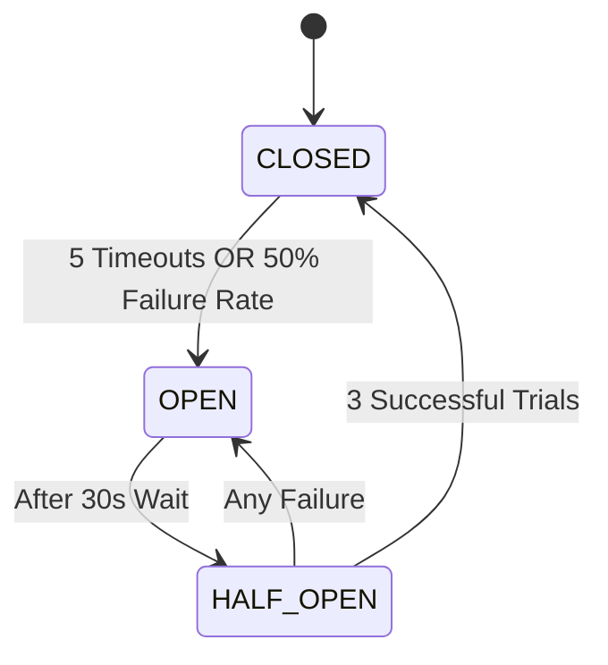

# 🎬 Fault-Tolerant Movie Recommendation System

A resilient, microservices-based movie recommendation system built with Node.js and Docker. This project demonstrates the **Circuit Breaker** pattern to prevent cascading failures in distributed systems, ensuring high availability and graceful degradation.

---

## 🏗 Architecture & Design

The system is composed of four interconnected microservices:

- **`recommendation-service`**: The central orchestrator. It fetches user preferences and movie content, wrapping each call in a custom-built Circuit Breaker.
- **`user-profile-service`**: Provides user preferences. Supports failure simulation.
- **`content-service`**: Provides movie metadata based on genres. Supports failure simulation.
- **`trending-service`**: A reliable fallback service that provides general trending movies when primary dependencies are unavailable.

### 🛡 Circuit Breaker Implementation

The system implements a state-machine based Circuit Breaker with three states:



| Config | Value | Description |
| :--- | :--- | :--- |
| **Timeout** | 2000ms | Max time to wait for a dependency before timing out. |
| **Failure Threshold** | 5 | Consecutive timeouts or errors to trip the circuit. |
| **Window Size** | 10 | Moving window for calculating failure percentage. |
| **Open Duration** | 30s | Time the circuit stays OPEN before entering HALF-OPEN. |

---

## 🔌 Graceful Degradation Strategy

| Failure Scenario | Fallback Action | Resulting UX |
| :--- | :--- | :--- |
| `user-profile` fails | Use default preferences (`Comedy`, `Family`) | User gets generic but relevant recommendations. |
| `content` fails | Return empty recommendations | User sees their profile but no specific movie list. |
| Both fail | Fetch from `trending-service` | User sees "Temporarily Degraded" message with Trending Movies. |

---

## 🚀 Getting Started

### 1. Prerequisites
- [Docker & Docker Compose](https://www.docker.com/products/docker-desktop)
- [Node.js](https://nodejs.org/) (for running the verification script)

### 2. Quick Start
```bash
# 1. Setup environment variables
cp .env.example .env

# 2. Build and start services
docker-compose up --build -d
```
The API is now available at `http://localhost:8080`.

### 3. Verification & Testing
Run the automated resilience test suite:
```bash
npm install axios
node verify.js
```

---

## 📍 API Specification

### Primary Endpoint
- **GET** `/recommendations/:userId`
  - Fetches personalized recommendations.
  - Automatically handles fallbacks and short-circuits.

### Simulation Control
- **POST** `/simulate/:service/:behavior`
  - `:service`: `user-profile` or `content`
  - `:behavior`: `normal`, `slow` (latency), `fail` (500 errors)

### Monitoring
- **GET** `/metrics/circuit-breakers`
  - Provides real-time state, failure rates, and call statistics.

---

## 🛠 Tech Stack
- **Runtime**: Node.js (Express)
- **Containerization**: Docker, Docker Compose
- **Communication**: REST / HTTP
- **Resilience**: Custom Circuit Breaker Logic

---
*Developed as a showcase for Fault-Tolerant Distributed Systems.*
